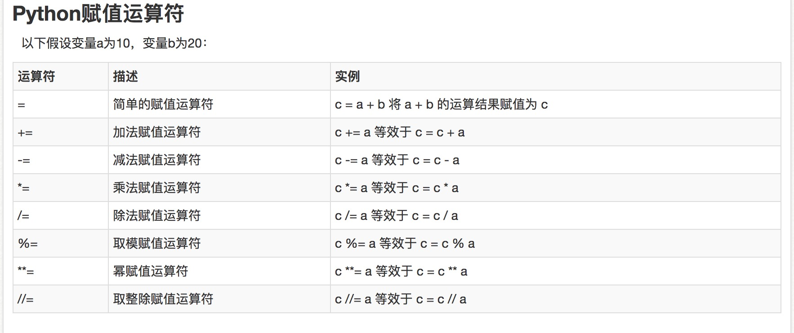

## Python 3.x 入门
 >数据类型   
 
*** 
#### Number 类型
```Python
# int    整形
# float   浮点型
# Python  只有 float
# 其他语言中又分单精度 (float) 和爽精度 ( double )

type (2/2)   # 输出 float 1.0
type (2//2)  # 输出 int 1
# 双//  只保留整数部分
```
#### Boolean
```Python
# 任何空值都是---->false
print(r"hello \n world") # 输出  hello\world 所见即所得
```

#### String

```Python
1. "hello world"[0:5]  # 输出 hello
2. "hello world"[-5:]  # 输出 world
```
##### tuple
```Python
1. type((1)) #输出的 int
1. type(('hello')) #输出的 str
3. type((1,))  #输出 tuple
#如何表示一个空 tuple
#
```

##### list

```Python
1. ["死神","大剑","妖怪名单"] [0] #输出 死神
2. ["死神","大剑","妖怪名单"] [1:] #输出 大剑 妖怪名单
3. ["死神","大剑","妖怪名单"] [-2:] #输出 大剑 妖怪名单
4. ["死神","大剑","妖怪名单"]*2 #输出 ["死神","大剑","妖怪名单","死神","大剑","妖怪名单"]

# 3 在不在 ["死神","大剑","妖怪名单"] ?
3 in ["死神","大剑","妖怪名单"]
# 输出 False

# 3 不在 ["死神","大剑","妖怪名单"] ?
3 not in ["死神","大剑","妖怪名单"]
# 输出 False

5. 查看 列表的长度
len(["死神","大剑","妖怪名单"])

6. 查看列表中最大的
max([1,2,3,4,5,6])
#输出 6
max(["死神","大剑","妖怪名单"])
# 输出 死神
min(["死神","大剑","妖怪名单"])
#输出 大剑

# 比较的是 字符串的ascii码  可以用ord() 函数查看字符的ascii 码
ord("a")  # 输出 97
ord("b")  # 输出 98
```

#### 集合 set  非常重要的特点 无序
```Python
# 特点  不重复
{1,12,21,21,21,11111}  # 输出 {1, 12, 21, 11111}
# 把 {3,4} 的集合 在{1,2,3,4,5,6,7} 去2个集合的 差集
{1,2,3,4,5,6,7} - {3,4}
#输出 {1, 2, 5, 6, 7}

# 找出 {1,2,3,4,5,6,7} {3,4} 2个集合里面共有的元素 交集
{1,2,3,4,5,6,7} & {3,4} 
# 输出 {3,4}

# 找出 {1,2,3,4,5,6,7} {3,4} 2个集合里面 去掉重复的在合在一起  并集
{1,2,3,4,5,6,7} | {3,4}
# 输出 {1,2,3,4,5,6,7} 

# 空的集合如何创建
type(set()) # 输出 set
len(set())  # 输出 0

```

#### 字典 dict  key :  value  集合类型
```Python
# {"name":"mifan","class":"三年二班"}
# {"Q":"新月打击 ","W":"苍白之爆"}
# key 不可变类型
dist = {"Q":"新月打击 ","W":"苍白之爆"}

```

#### Python的基本数据类型的总结:
```Python

```


>Python运算符

*** 
#### 变量
```Python
    a = 'python'
    a = a + 'hello'

    a = [1,2,3]
    id(a)
```

#### 算数运算符


#### 赋值运算符


#### 比较(关系)运算符


#### 逻辑运算符


#### 成员运算符


#### 身份运算符


